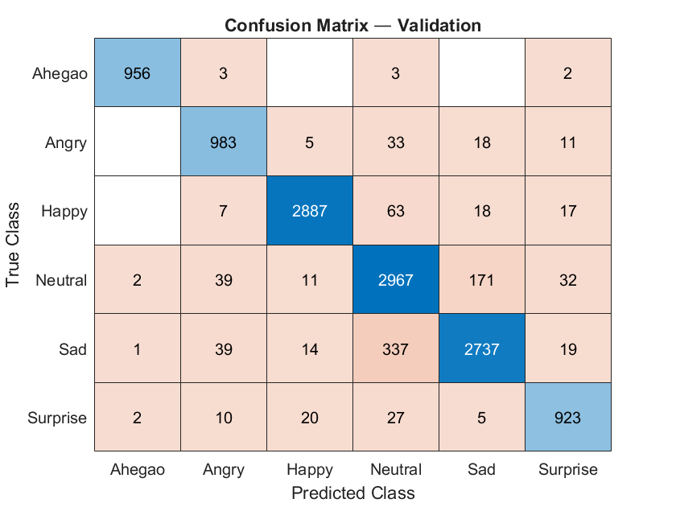

# Facial Emotion Detection with MATLAB CNN

A comprehensive MATLAB pipeline for training and running a convolutional neural network (CNN) to detect facial emotions in images, with both automated (MTCNN‐based) and manual face selection workflows.

---

## Table of Contents

1. [Description](#description)  
2. [Requirements](#requirements)  
3. [Installation](#installation)  
4. [Data Preparation](#data-preparation)
5. [Results](#results)
6. [License](#license)  
9. [Contact](#contact)
---

## Description

This repository contains MATLAB code to:

- Train a facial emotion detection CNN (`trainModel.mlx`)  
- Detect and classify emotions on faces automatically using MTCNN (`detectEmotionsOnFacesMtcnn.m`)  
- Detect and classify emotions via manual face‐region selection (`detectEmotions.m`)

The trained model (`emotionCNN10.mat`) is saved for reuse.

---

## Requirements

- **MATLAB** R2021b or later  
- **Deep Learning Toolbox**  
- **Image Processing Toolbox**  
- **MTCNN Face Detection**   

---

## Installation

```bash
git clone https://github.com/Dipesh-Lc/facial-emotion-cnn-matlab.git
cd facial-emotion-cnn-matlab
```
---

## Data Preparation
Download data from: https://data.mendeley.com/datasets/5ck5zz6f2c/2
Organize your face‐emotion images into a dataset/ folder with subfolders for each emotion label:
dataset/
├── Ahegao/
├── Angry/
├── Happy/
├── Sad/
├── Surprise/
└── Neutral/

## Results


## License
This project is licensed under the MIT License. See [LICENSE](LICENSE) for details.
